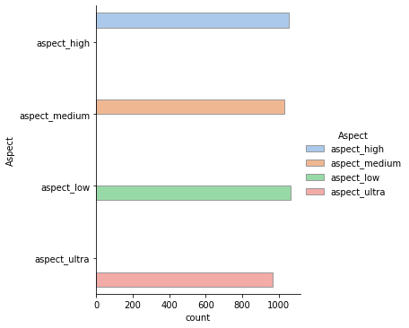
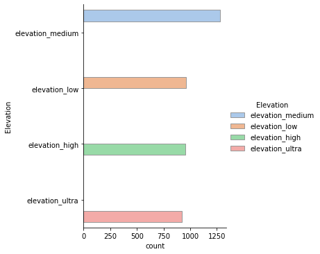
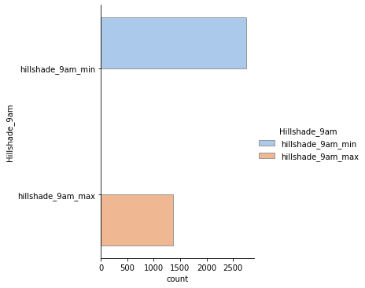
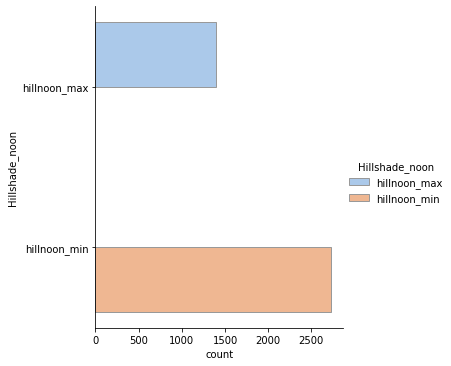
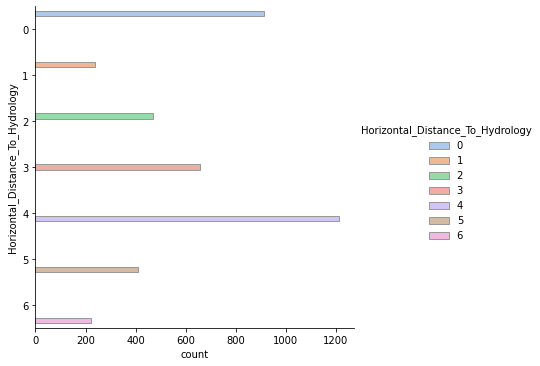
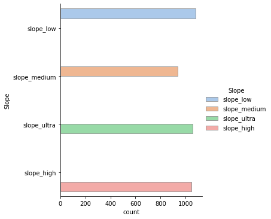
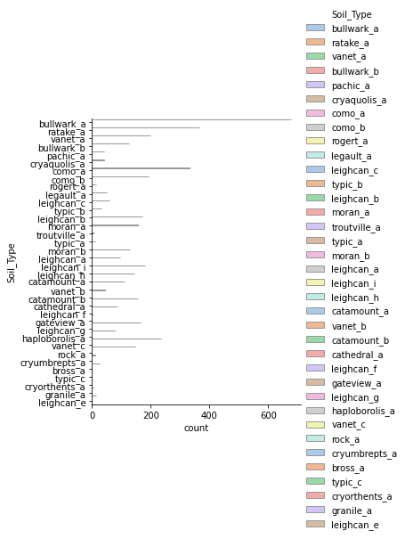
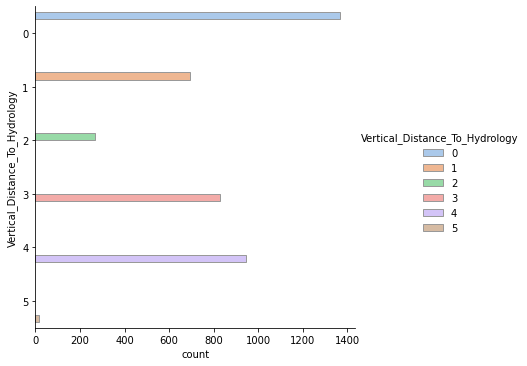
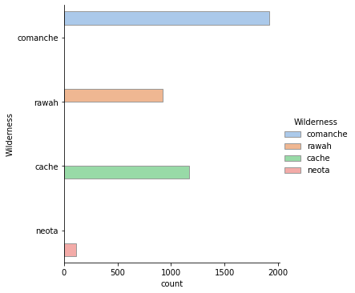

# Comparison-Of-Different-Clusterig-Methods
In this project I have used differet clustering algorithms like K-Means, K-Means++, DBScan, and others also.I have added the codes along with the report. 

